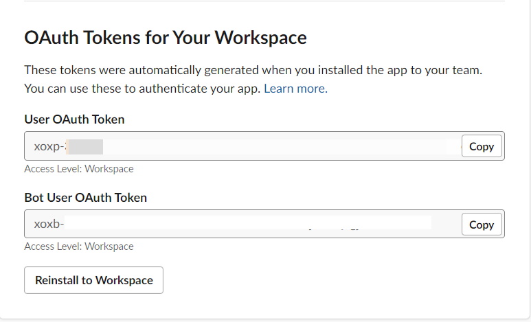
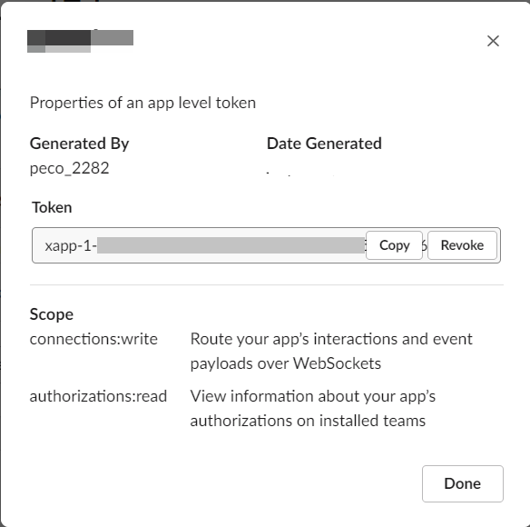

Startup for create Slack APP
============================

Creating App
------------
1. Log in `Slack API page <https://api.slack.com/apps/>`_.

App Token
----------
1. Your App site.
2. move `install app` tab.
3. copy token.
user oauth token
bot user oauth token.

4. move `OAuth & Permissions` tab.
5. copy

